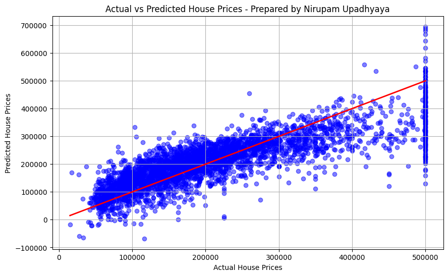

# Predictive Modeling with Linear Regression - Task 3

## 📊 Project Overview
This project is part of the Data Science & Analytics Internship at Future Interns. The objective of this task is to build a predictive machine learning model using Linear Regression to estimate house prices based on various housing features.

## 📁 Dataset
* **Source:** California Housing Dataset (Built-in via Scikit-Learn)
* **Domain:** Real Estate / Predictive Analytics

## 🛠️ Tools & Libraries Used
* **Language:** Python (Jupyter Notebook / Google Colab)
* **Libraries:** Pandas, NumPy, Scikit-Learn, Matplotlib

## 🖼️ Model Performance Visualization

## 💡 Model Evaluation & Insights
* **R-squared (R²): 0.66** * The model successfully explains 66% of the variance in housing prices, indicating a strong foundational predictive capability based on the provided features (e.g., median income, house age, average rooms).
* **Mean Squared Error (MSE): 4,634,658,406.22**
* **Conclusion:** The Linear Regression model provides a reliable baseline for real estate price prediction. The scatterplot demonstrates a clear positive correlation between the model's predicted prices and the actual market values.

---
*Prepared by Nirupam Upadhyaya*
